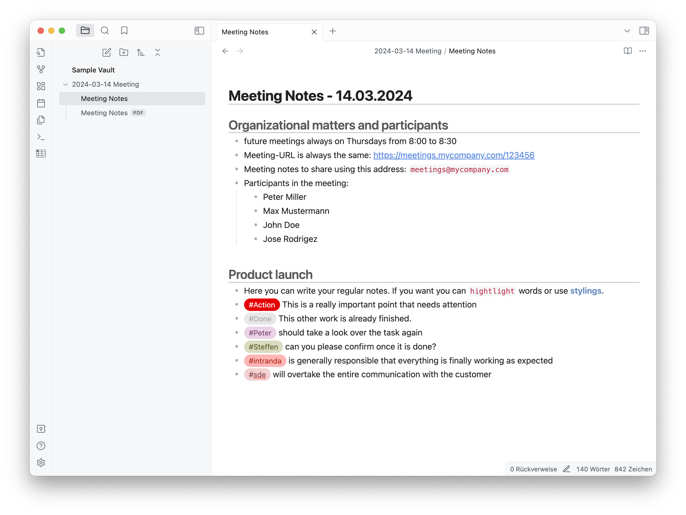
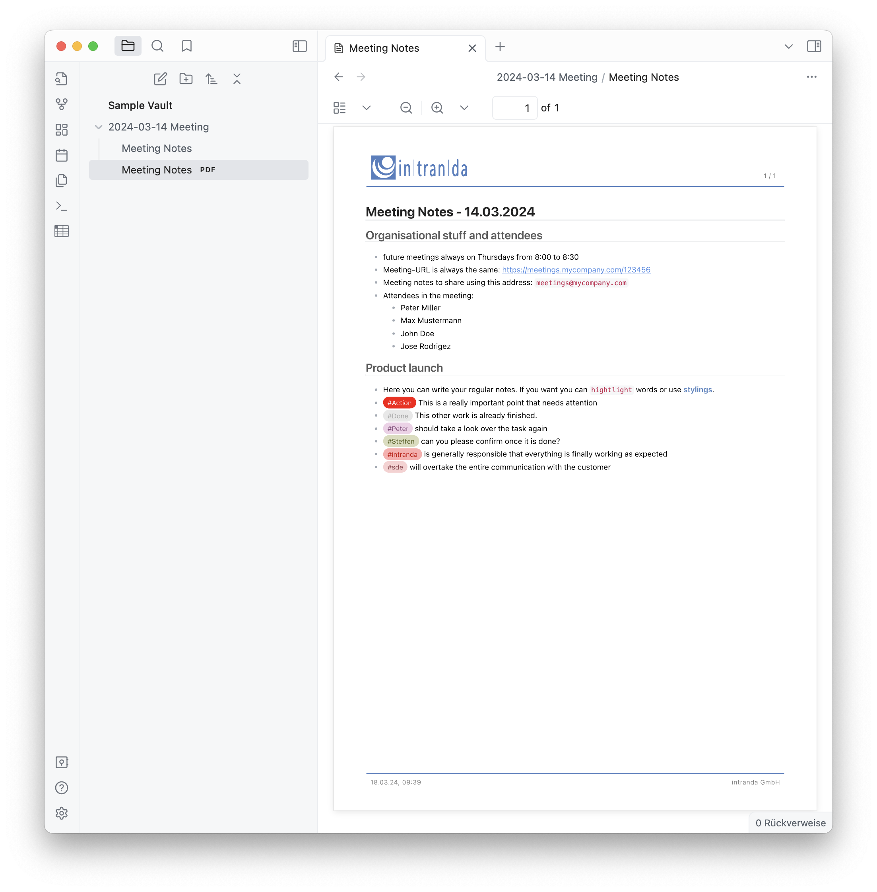

# Obsidian Kickstart
This is a repository to easily start using Obsidian for Meeting Notes and to let these be converted to PDF files with custom corporate design. The adapted theme looks like this:



# Usage
Once this kickstart package is installed you can use the following tipps and tricks to benefit from it:

## Tags
In this package you find a plugin that colors your tags individually and manages to color the same tags in the same color across different documents. Simply use a tag like this and you will see: `#Peter`. This is ideal to tag tasks to individual users that will always be styled in the same color.

If you are using the tags `#done` or `#erledigt` you will notice a bright grey tag color to mark things as done.

## PDF Export
The embedded PDF Export is customized to some specific corporate designs, dependent on the package that you installed inside of your Vault. To use it simply right click on a document in the left section and trigger the `Better Export PDF` plugin. It will generate a PDF file with the same name as your document and will store it directly beside it in the same folder.



## Keyboard shortcuts
These shortcuts are preconfigured additionally to Obsidians defaults:

| Shortcut                           | Function                                                       |
| ---------------------------------- | -------------------------------------------------------------- |
| `option` + `command` + `g`         | Highlight the current document in the file list                |
| `option` + `command` + `f`         | Open Finder for the path of the current document               |
| `option` + `command` + `p`         | Generate a PDF file with corporate design for the current note |
| `option` + `up`                    | Move current line upwards                                      |
| `option` + `down`                  | Move current line downwards                                    |
| `option` + `command` + `Backspace` | Strike through the selected text                               |
| `option` + `command` + `c`         | Format selected text as code                                   |
| `option` + `command` + `h`         | Format selected text as highlighted                            |

## Page breaks
Use this to create a page break inside of your generated PDF file:

```html
<div class="page"/>
```

# Installation
To use this Kickstart package first you need to install Obsidian of course. Afterwards open the Terminal and execute the following commands:

## 1) Go to Vault root folder
First go into the root folder where a new Vault shall be created:

```bash
# go to the Vault root folder
cd ~/my-vault-folder
```

## 2) Download and install the correct corporate design
Now download and unzip the kickstarter files for the appropriate corporate design.

### a) intranda 
Download and unzip the kickstarter files for the intranda corporate design:

```bash
wget https://github.com/SteffenHankiewicz/obsidian-kickstart/releases/latest/download/obsidian-intranda.zip -O o.zip
unzip o.zip
rm o.zip
```

### b) ScanDataExperts 
Download and unzip the kickstarter files for the ScanDataExperts corporate design:

```bash
wget https://github.com/SteffenHankiewicz/obsidian-kickstart/releases/latest/download/obsidian-sde.zip -O o.zip
unzip o.zip
rm o.zip
```

### c) University Greifswald 
Download and unzip the kickstarter files for the University Greifswald corporate design:

```bash
wget https://github.com/SteffenHankiewicz/obsidian-kickstart/releases/latest/download/obsidian-greifswald.zip -O o.zip
unzip o.zip
rm o.zip
```

### d) neutral design  
Download and unzip the kickstarter files for a neutral design without any logo and without a company name:

```bash
wget https://github.com/SteffenHankiewicz/obsidian-kickstart/releases/latest/download/obsidian-neutral.zip -O o.zip
unzip o.zip
rm o.zip
```
Editing the file `.obsidian/plugins/obsidian-better-export-pdf/data.json` allows you to simply use your personal name inside of this neutral header design. To do so simply replace the string `<!-- YOUR NAME HERE -->` With your name there


## 3) Use this kickstarter package in Obsidian
Now you can start Obsidian and use the kickstart files by opening the Vault that you prepared. 

- You will notice simple clean layout for your notes
- Using #tags will show these with different colors to highlight responsibilities
- Using the tag #done or #erledigt will have a bright grey tag color to mark things as done
- Use the configured PDF export (Better Export PDF) with your corporate design to get a shareable PDF stored directly beside your current document

# Update your setup
If you like to update your setup with the newest files from this repository you just have to replace your current files as described below. It can happen manually inside of the hidden `.obsidian` folder or automatically by using the commands for Mac and Linux below after switching on commandline first into the vaults main directory:

```bash
cd /path/to/your/vault
```

## Install a Theme Update
As this theme is under development you might want to update your vault to use the newest version of the theme. This is possible without any side effects for your data or your other configuration. E.g. you personal customizations and tag colors are not affected. Simply replace inside of the hidden `.obsidian` this file: `themes/intranda/theme.css`. Using a Mac or Linux simply go into the vaults main directory and do the following on commandline to automatically do it:

```bash
wget https://raw.githubusercontent.com/SteffenHankiewicz/obsidian-kickstart/refs/heads/main/.obsidian/themes/intranda/theme.css -O .obsidian/themes/intranda/theme.css
```

## Install Hotkey Update
To update your hotkeys to fit to this documentation can replace your current hotkey settings by overwriting the file `.obsidian/hotkeys.json`. On Mac or Linux simply call the following command on commandline from the the vaults main directory:

```bash
wget https://raw.githubusercontent.com/SteffenHankiewicz/obsidian-kickstart/refs/heads/main/.obsidian/hotkeys.json -O .obsidian/hotkeys.json
```
